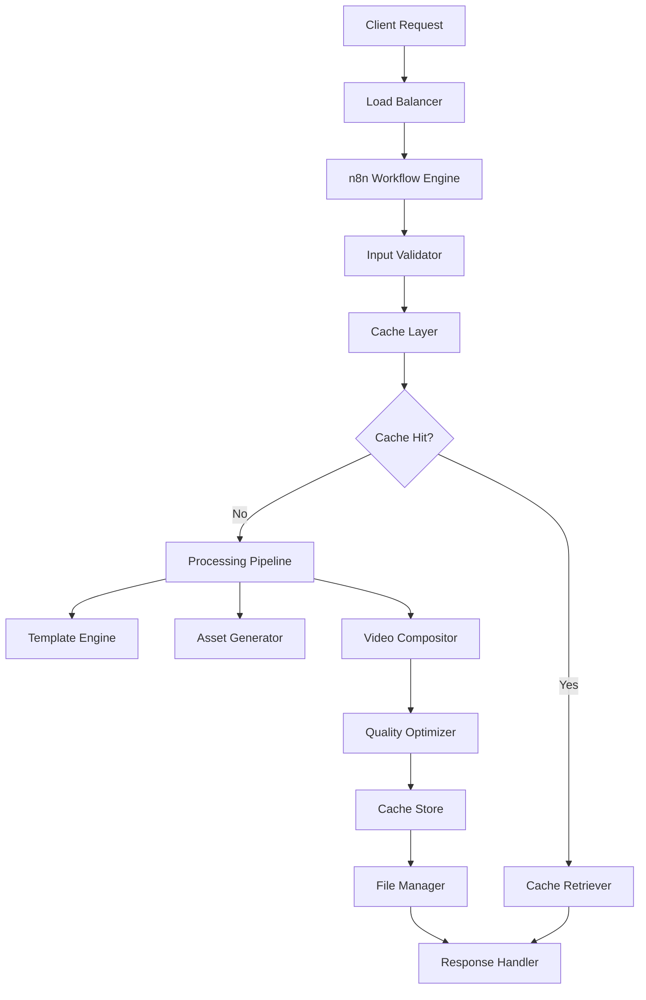
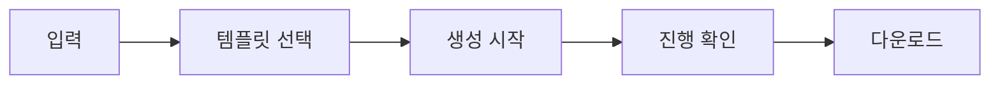
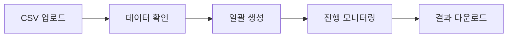

# **Version**: 1.0  
**Date**: 2025-01-19  
**Author**: Product Team  
**Status**: Ready for Development

---

## 📋 Executive Summary

### 🎯 Product Vision

n8n 기반의 초고속, 저비용 영상 생성 자동화 플랫폼을 개발하여 기업이 마케팅 컨텐츠를 99% 빠르게, 90% 저렴하게 제작할 수 있도록 지원

### 🏆 Business Objectives

- **처리 속도**: 30초 영상을 30초 이내 생성 (기존 도구 대비 10x 향상)
- **비용 절감**: 외부 API 의존성 제거로 월 비용 90% 절감
- **품질 보장**: 1080p 이상 프로페셔널 품질 보장
- **확장성**: 동시 100개 요청 처리 가능

### 📊 Key Metrics

|메트릭|현재|목표|측정 방법|
|---|---|---|---|
|영상 생성 속도|5-10분|30초 이내|서버 로그 분석|
|시스템 가동률|-|99.5%|모니터링 도구|
|사용자 만족도|-|4.5/5|설문조사|
|캐시 히트율|-|70%|시스템 메트릭|

---

## 🔍 Problem Statement

### 현재 문제점

1. **높은 비용**: 외부 AI 서비스 월 $500-2000 소요
2. **느린 처리**: 영상 1개 생성에 5-10분 소요
3. **품질 일관성**: 결과물 품질 예측 불가
4. **의존성 리스크**: 외부 서비스 장애 시 업무 중단
5. **커스터마이징 한계**: 브랜드 가이드라인 적용 어려움

### 비즈니스 임팩트

- 마케팅 컨텐츠 제작 지연으로 기회 손실
- 높은 제작 비용으로 ROI 저하
- 일관성 없는 브랜딩으로 브랜드 가치 훼손

---

## 👥 Target Users

### Primary Users

**마케팅 담당자 (Marketing Specialist)**

- 소속: 중소기업~대기업 마케팅팀
- 경험: 디지털 마케팅 2-5년
- 니즈: 빠른 컨텐츠 제작, 브랜드 일관성, 비용 효율성
- 페인포인트: 시간 부족, 제작 비용, 디자인 리소스 부족

### Secondary Users

**컨텐츠 크리에이터 (Content Creator)**

- 소속: 1인 크리에이터, 소규모 에이전시
- 경험: 소셜미디어 운영 1-3년
- 니즈: 자동화, 다양한 포맷 지원, 쉬운 사용법
- 페인포인트: 반복 작업, 플랫폼별 최적화

### Enterprise Users

**IT 관리자 (IT Administrator)**

- 소속: 대기업 IT팀
- 경험: 시스템 관리 5년 이상
- 니즈: 안정성, 확장성, 보안, 관리 편의성
- 페인포인트: 시스템 통합, 보안 규정 준수

---

## 🎯 Product Goals & Success Criteria

### Phase 1 Goals (MVP - 2개월)

|Goal|Success Criteria|Priority|
|---|---|---|
|기본 영상 생성|3가지 템플릿으로 30초 영상 생성|P0|
|처리 속도 최적화|30초 영상을 60초 이내 생성|P0|
|기본 캐싱|캐시 히트율 50% 달성|P0|
|안정성 확보|99% 가동률 달성|P1|

### Phase 2 Goals (확장 - 3개월)

|Goal|Success Criteria|Priority|
|---|---|---|
|AI 통합|텍스트-이미지 생성 연동|P1|
|멀티플랫폼|5개 소셜미디어 포맷 지원|P1|
|배치 처리|동시 10개 영상 처리|P2|
|브랜딩 자동화|브랜드 가이드라인 자동 적용|P2|

### Phase 3 Goals (스케일링 - 6개월)

|Goal|Success Criteria|Priority|
|---|---|---|
|엔터프라이즈|동시 100개 요청 처리|P1|
|고급 AI|완전 생성형 영상|P2|
|API 제공|써드파티 통합 지원|P2|

---

## 🏗️ System Architecture

### High-Level Architecture



### Technology Stack

| Layer            | Technology           | Justification  |
| ---------------- | -------------------- | -------------- |
| Workflow Engine  | n8n                  | 비주얼 워크플로우, 확장성 |
| Video Processing | FFmpeg + MediaFX     | 고성능, 오픈소스      |
| Cache            | Redis + File System  | 다층 캐싱 전략       |
| Database         | PostgreSQL           | 메타데이터 관리       |
| Monitoring       | Prometheus + Grafana | 실시간 모니터링       |
| Container        | Docker + K8s         | 확장성, 배포 편의성    |

### Data Flow

1. **Request Ingestion**: Webhook/API로 요청 수신
2. **Validation**: 입력 데이터 검증 및 표준화
3. **Cache Check**: MD5 해시 기반 캐시 확인
4. **Processing**: 템플릿 + 에셋 조합하여 영상 생성
5. **Optimization**: 플랫폼별 품질 최적화
6. **Storage**: 결과물 저장 및 캐시 업데이트
7. **Response**: 클라이언트에 결과 반환

---

## ⚙️ Functional Requirements

### FR-001: 영상 생성 엔진

**우선순위**: P0  
**설명**: 텍스트 입력을 받아 영상을 자동 생성

#### Acceptance Criteria

- [ ] 제목, 내용, 스타일을 입력받아 영상 생성
- [ ] 3가지 기본 템플릿 지원 (corporate, social, education)
- [ ] 1080p 해상도 출력
- [ ] 30초 영상을 60초 이내 처리
- [ ] 오류 발생 시 상세 메시지 제공

#### API Specification

```json
POST /api/v1/generate-video
{
  "title": "제품 소개",
  "content": "새로운 AI 기술로 업무 효율성을 높이세요",
  "style": "corporate",
  "duration": 30,
  "resolution": "1080p",
  "format": "mp4"
}

Response:
{
  "status": "success",
  "videoId": "vid_12345",
  "videoUrl": "https://domain.com/videos/vid_12345.mp4",
  "duration": 30,
  "processingTime": 25.3,
  "cached": false
}
```

### FR-002: 템플릿 관리 시스템

**우선순위**: P0  
**설명**: 영상 템플릿 생성, 수정, 관리

#### Acceptance Criteria

- [ ] 템플릿 CRUD 기능
- [ ] 템플릿별 설정 관리 (색상, 폰트, 레이아웃)
- [ ] 미리보기 기능
- [ ] 템플릿 복제 기능
- [ ] 사용 통계 추적

### FR-003: 캐싱 시스템

**우선순위**: P0  
**설명**: 생성된 영상을 캐시하여 재사용

#### Acceptance Criteria

- [ ] 입력 기반 캐시 키 생성
- [ ] 메모리 + 디스크 다층 캐싱
- [ ] TTL 기반 캐시 만료
- [ ] 캐시 히트율 모니터링
- [ ] 수동 캐시 무효화

### FR-004: 품질 최적화

**우선순위**: P1  
**설명**: 플랫폼별 최적 품질로 자동 변환

#### Acceptance Criteria

- [ ] 플랫폼별 프리셋 (YouTube, Instagram, TikTok 등)
- [ ] 적응형 비트레이트 조정
- [ ] 압축 최적화
- [ ] 메타데이터 자동 삽입

### FR-005: 배치 처리

**우선순위**: P1  
**설명**: 여러 영상을 동시에 처리

#### Acceptance Criteria

- [ ] 대기열 기반 작업 관리
- [ ] 우선순위 설정
- [ ] 진행 상황 추적
- [ ] 실패 시 재시도 로직

---

## 🔧 Non-Functional Requirements

### NFR-001: 성능 요구사항

|메트릭|요구사항|측정 방법|
|---|---|---|
|응답 시간|30초 영상 < 60초 처리|서버 로그|
|처리량|동시 10개 요청 처리|부하 테스트|
|캐시 성능|히트율 > 50%|모니터링|
|메모리 사용량|Peak < 4GB|시스템 모니터링|

### NFR-002: 가용성 요구사항

- **가동률**: 99.5% (월 3.6시간 이내 다운타임)
- **복구 시간**: 평균 < 5분
- **백업**: 일일 자동 백업
- **장애 대응**: 24시간 내 복구

### NFR-003: 확장성 요구사항

- **수평 확장**: K8s 기반 자동 스케일링
- **수직 확장**: CPU/메모리 동적 할당
- **저장소**: 무제한 확장 가능
- **네트워크**: CDN 연동 지원

### NFR-004: 보안 요구사항

- **인증**: JWT 기반 API 인증
- **권한**: RBAC 기반 접근 제어
- **암호화**: TLS 1.3 통신 암호화
- **감사**: 모든 작업 로그 기록

---

## 🎨 User Experience Design

### UX Principles

1. **Simplicity First**: 최소한의 입력으로 최대 결과
2. **Instant Feedback**: 실시간 진행 상황 표시
3. **Progressive Disclosure**: 단계별 정보 노출
4. **Error Prevention**: 사전 유효성 검사

### User Journey Map

#### 신규 사용자 (First-time User)

1. **Discovery** → 랜딩 페이지 방문
2. **Trial** → 샘플 영상 생성
3. **Evaluation** → 결과물 품질 확인
4. **Conversion** → 회원가입 및 결제

#### 기존 사용자 (Return User)

1. **Access** → 대시보드 접속
2. **Create** → 영상 생성 요청
3. **Monitor** → 처리 상황 확인
4. **Download** → 결과물 다운로드

### Key User Flows

#### Flow 1: 빠른 영상 생성



#### Flow 2: 배치 처리



### Wireframes

#### 메인 대시보드

```
┌─────────────────────────────────────┐
│ 🎬 영상 생성 시스템                    │
├─────────────────────────────────────┤
│ [새 영상 생성] [배치 처리] [설정]      │
├─────────────────────────────────────┤
│ 📊 실시간 통계                        │
│ • 오늘 생성: 24개                     │
│ • 평균 처리 시간: 32초                │
│ • 캐시 히트율: 68%                    │
├─────────────────────────────────────┤
│ 📋 최근 생성 목록                     │
│ [영상1] [다운로드] [삭제]             │
│ [영상2] [다운로드] [삭제]             │
└─────────────────────────────────────┘
```

#### 영상 생성 폼

```
┌─────────────────────────────────────┐
│ 새 영상 생성                          │
├─────────────────────────────────────┤
│ 제목: [________________]              │
│ 내용: [________________]              │
│       [________________]              │
│ 스타일: [Corporate ▼]                 │
│ 길이: [30초 ▼]                       │
│ 해상도: [1080p ▼]                    │
├─────────────────────────────────────┤
│ [미리보기] [생성하기]                 │
└─────────────────────────────────────┘
```

---

## 🛠️ Technical Implementation

### Development Stack

```yaml
Backend:
  - Runtime: Node.js 18+ LTS
  - Framework: n8n 1.0+
  - Database: PostgreSQL 15+
  - Cache: Redis 7+
  - Queue: Bull/BullMQ

Video Processing:
  - Engine: FFmpeg 6.0+
  - Extension: n8n-nodes-mediafx
  - Codecs: H.264, H.265, VP9

Infrastructure:
  - Container: Docker 24+
  - Orchestration: Kubernetes 1.28+
  - Monitoring: Prometheus + Grafana
  - Logging: ELK Stack

DevOps:
  - CI/CD: GitHub Actions
  - IaC: Terraform
  - Secrets: HashiCorp Vault
```

### Database Schema

#### Videos Table

```sql
CREATE TABLE videos (
    id UUID PRIMARY KEY DEFAULT gen_random_uuid(),
    title VARCHAR(255) NOT NULL,
    content TEXT NOT NULL,
    style VARCHAR(50) NOT NULL,
    duration INTEGER NOT NULL,
    resolution VARCHAR(20) NOT NULL,
    format VARCHAR(10) NOT NULL,
    file_path VARCHAR(500),
    file_size BIGINT,
    processing_time INTEGER,
    cache_key VARCHAR(64) UNIQUE,
    cached BOOLEAN DEFAULT false,
    status VARCHAR(20) DEFAULT 'pending',
    created_at TIMESTAMP DEFAULT NOW(),
    updated_at TIMESTAMP DEFAULT NOW(),
    user_id UUID REFERENCES users(id)
);

CREATE INDEX idx_videos_cache_key ON videos(cache_key);
CREATE INDEX idx_videos_user_id ON videos(user_id);
CREATE INDEX idx_videos_status ON videos(status);
```

#### Templates Table

```sql
CREATE TABLE templates (
    id UUID PRIMARY KEY DEFAULT gen_random_uuid(),
    name VARCHAR(100) NOT NULL,
    description TEXT,
    style VARCHAR(50) NOT NULL,
    duration INTEGER NOT NULL,
    file_path VARCHAR(500) NOT NULL,
    thumbnail_path VARCHAR(500),
    config JSONB NOT NULL,
    active BOOLEAN DEFAULT true,
    created_at TIMESTAMP DEFAULT NOW(),
    updated_at TIMESTAMP DEFAULT NOW()
);
```

### API Endpoints

#### Core Endpoints

```yaml
POST /api/v1/videos:
  summary: "영상 생성 요청"
  parameters:
    - title: string (required)
    - content: string (required)
    - style: enum (corporate, social, education)
    - duration: integer (15, 30, 60)
    - resolution: enum (720p, 1080p, 4k)
  responses:
    201: "생성 시작됨"
    400: "잘못된 요청"
    429: "요청 한도 초과"

GET /api/v1/videos/{id}:
  summary: "영상 상태 조회"
  responses:
    200: "성공"
    404: "영상 없음"

GET /api/v1/videos/{id}/download:
  summary: "영상 다운로드"
  responses:
    200: "파일 스트림"
    404: "파일 없음"

GET /api/v1/templates:
  summary: "템플릿 목록 조회"
  responses:
    200: "템플릿 목록"
```

### n8n Workflow Configuration

#### Main Workflow

```json
{
  "name": "Ultra-Efficient Video Generator",
  "active": true,
  "nodes": [
    {
      "parameters": {
        "path": "generate-video",
        "httpMethod": "POST",
        "responseMode": "responseNode"
      },
      "name": "Video Request Webhook",
      "type": "n8n-nodes-base.webhook"
    },
    {
      "parameters": {
        "functionCode": "// Input validation and configuration\nconst input = $input.first().json;\n\n// Validation rules\nif (!input.title || input.title.length < 1) {\n  throw new Error('Title is required');\n}\nif (!input.content || input.content.length < 1) {\n  throw new Error('Content is required');\n}\n\n// Template mapping\nconst templates = {\n  'corporate': { file: 'corporate_30s.mp4', duration: 30 },\n  'social': { file: 'social_15s.mp4', duration: 15 },\n  'education': { file: 'education_60s.mp4', duration: 60 }\n};\n\nconst template = templates[input.style] || templates.corporate;\n\n// Generate cache key\nconst crypto = require('crypto');\nconst cacheKey = crypto.createHash('md5')\n  .update(`${input.style}_${input.title}_${input.content}`)\n  .digest('hex');\n\n// Configuration object\nconst config = {\n  id: `vid_${Date.now()}`,\n  title: input.title,\n  content: input.content,\n  style: input.style || 'corporate',\n  duration: input.duration || template.duration,\n  resolution: input.resolution || '1080p',\n  format: input.format || 'mp4',\n  template: template,\n  cacheKey: cacheKey,\n  outputPath: `/opt/video-system/outputs/video_${Date.now()}.mp4`,\n  timestamp: Date.now()\n};\n\nreturn { json: config };"
      },
      "name": "Input Processor",
      "type": "n8n-nodes-base.function"
    }
  ],
  "connections": {
    "Video Request Webhook": {
      "main": [
        [
          {
            "node": "Input Processor",
            "type": "main",
            "index": 0
          }
        ]
      ]
    }
  }
}
```

---

## 📊 Analytics & Monitoring

### Key Performance Indicators (KPIs)

|Category|Metric|Target|Tracking Method|
|---|---|---|---|
|Performance|Avg Processing Time|< 45초|Application Logs|
|Quality|Success Rate|> 99%|Error Tracking|
|Efficiency|Cache Hit Rate|> 70%|Redis Metrics|
|Usage|Daily Active Users|TBD|User Analytics|
|Business|Revenue per User|TBD|Billing System|

### Monitoring Setup

```yaml
Prometheus Metrics:
  - video_generation_duration_seconds
  - video_generation_total
  - cache_hit_rate
  - system_resource_usage
  - queue_length

Grafana Dashboards:
  - System Overview
  - Video Processing Metrics  
  - Cache Performance
  - Error Tracking
  - Business Metrics

Alerting Rules:
  - Processing time > 120s
  - Error rate > 5%
  - Cache hit rate < 30%
  - Queue length > 100
  - Disk usage > 80%
```

### Logging Strategy

```yaml
Log Levels:
  - DEBUG: 개발 디버깅
  - INFO: 일반 작업 기록
  - WARN: 잠재적 문제
  - ERROR: 처리 실패
  - FATAL: 시스템 장애

Log Structure:
  timestamp: ISO 8601
  level: string
  service: string
  user_id: string
  video_id: string
  message: string
  metadata: object
```

---

## 🧪 Testing Strategy

### Testing Pyramid

```
        ┌─────────────┐
        │  E2E Tests  │ 10%
        │   (UI 통합)   │
        └─────────────┘
       ┌─────────────────┐
       │ Integration    │ 30%
       │ Tests (API)    │
       └─────────────────┘
      ┌─────────────────────┐
      │   Unit Tests       │ 60%
      │ (비즈니스 로직)       │
      └─────────────────────┘
```

### Test Cases

#### Unit Tests

- [ ] 입력 유효성 검사 로직
- [ ] 캐시 키 생성 알고리즘
- [ ] 템플릿 선택 로직
- [ ] 파일 경로 생성 함수
- [ ] 에러 핸들링 함수

#### Integration Tests

- [ ] n8n 워크플로우 실행
- [ ] FFmpeg 명령어 처리
- [ ] 데이터베이스 CRUD
- [ ] Redis 캐싱 동작
- [ ] 파일 시스템 접근

#### E2E Tests

- [ ] 영상 생성 전체 플로우
- [ ] 배치 처리 워크플로우
- [ ] 에러 상황 처리
- [ ] 사용자 인터페이스
- [ ] API 응답 검증

### Performance Tests

```yaml
Load Testing:
  - 동시 사용자: 50명
  - 테스트 시간: 10분
  - 요청률: 5 req/sec
  - 성공률: > 99%

Stress Testing:
  - 점진적 부하 증가
  - 임계점 확인
  - 복구 능력 테스트

Volume Testing:
  - 대용량 파일 처리
  - 장기간 운영 테스트
  - 메모리 누수 확인
```

---

## 🚀 Deployment & DevOps

### Deployment Strategy

```yaml
Environment Flow:
  Development → Staging → Production

Deployment Method:
  - Blue-Green Deployment
  - Rolling Updates
  - Canary Releases (10% → 50% → 100%)

Rollback Strategy:
  - Automatic rollback on health check failure
  - Manual rollback within 5 minutes
  - Database migration rollback plan
```

### Infrastructure as Code

```hcl
# Terraform Configuration
resource "kubernetes_namespace" "video_system" {
  metadata {
    name = "video-system"
  }
}

resource "kubernetes_deployment" "n8n" {
  metadata {
    name      = "n8n-deployment"
    namespace = kubernetes_namespace.video_system.metadata[0].name
  }
  
  spec {
    replicas = 3
    
    selector {
      match_labels = {
        app = "n8n"
      }
    }
    
    template {
      metadata {
        labels = {
          app = "n8n"
        }
      }
      
      spec {
        container {
          image = "n8nio/n8n:latest"
          name  = "n8n"
          
          port {
            container_port = 5678
          }
          
          env {
            name  = "N8N_BASIC_AUTH_ACTIVE"
            value = "true"
          }
        }
      }
    }
  }
}
```

### CI/CD Pipeline

```yaml
# GitHub Actions Workflow
name: Video System CI/CD

on:
  push:
    branches: [main, develop]
  pull_request:
    branches: [main]

jobs:
  test:
    runs-on: ubuntu-latest
    steps:
      - uses: actions/checkout@v3
      - uses: actions/setup-node@v3
      - run: npm install
      - run: npm test
      - run: npm run lint
      
  build:
    needs: test
    runs-on: ubuntu-latest
    steps:
      - uses: actions/checkout@v3
      - uses: docker/build-push-action@v3
        with:
          push: true
          tags: registry/video-system:${{ github.sha }}
          
  deploy:
    needs: build
    runs-on: ubuntu-latest
    if: github.ref == 'refs/heads/main'
    steps:
      - uses: azure/k8s-deploy@v1
        with:
          manifests: k8s/
          images: registry/video-system:${{ github.sha }}
```

---

## 📋 Project Timeline

### Phase 1: MVP Development (8 weeks)

#### Week 1-2: 인프라 및 기반 구축

- [x] 개발 환경 설정
- [x] n8n 설치 및 구성
- [x] 기본 템플릿 제작
- [x] 데이터베이스 스키마 설계

#### Week 3-4: 핵심 기능 개발

- [ ] 영상 생성 워크플로우 구축
- [ ] 입력 검증 및 처리 로직
- [ ] 기본 캐싱 시스템
- [ ] 에러 핸들링 구현

#### Week 5-6: 통합 및 테스트

- [ ] 컴포넌트 통합 테스트
- [ ] 성능 최적화
- [ ] 보안 검증
- [ ] API 문서화

#### Week 7-8: 배포 및 안정화

- [ ] 스테이징 환경 배포
- [ ] 사용자 테스트
- [ ] 버그 수정 및 개선
- [ ] 프로덕션 배포

### Phase 2: 확장 기능 (6 weeks)

#### Week 9-10: AI 통합

- [ ] 로컬 AI 모델 연동
- [ ] 이미지 생성 기능
- [ ] 음성 합성 기능

#### Week 11-12: 플랫폼 최적화

- [ ] 멀티플랫폼 출력 지원
- [ ] 품질 자동 최적화
- [ ] 배치 처리 구현

#### Week 13-14: 사용자 경험 개선

- [ ] 웹 인터페이스 개발
- [ ] 실시간 진행 상황 표시
- [ ] 사용자 대시보드

### Phase 3: 엔터프라이즈 (8 weeks)

#### Week 15-18: 확장성 구현

- [ ] 멀티테넌시 지원
- [ ] 고급 캐싱 전략
- [ ] 분산 처리 시스템

#### Week 19-22: 엔터프라이즈 기능

- [ ] RBAC 권한 관리
- [ ] 감사 로그 시스템
- [ ] 고급 모니터링

---

## 💰 Budget & Resources

### Development Team

|Role|Count|Duration|Rate|Total|
|---|---|---|---|---|
|Tech Lead|1|22주|$150/h|$132,000|
|Senior Developer|2|22주|$120/h|$211,200|
|Junior Developer|2|18주|$80/h|$115,200|
|DevOps Engineer|1|12주|$130/h|$62,400|
|QA Engineer|1|16주|$90/h|$57,600|
|**Total**|**7**|**-**|**-**|**$578,400**|

### Infrastructure Costs (Monthly)

|Service|Specification|Cost|
|---|---|---|
|Kubernetes Cluster|4 nodes (8 CPU, 32GB RAM)|$800|
|Storage|500GB SSD|$50|
|CDN|1TB transfer|$40|
|Monitoring|Prometheus + Grafana|$100|
|Backup|Daily backup|$30|
|**Total**|**-**|**$1,020/month**|

### Software Licenses

|Software|License|Annual Cost|
|---|---|---|
|n8n Enterprise|Self-hosted|$0|
|FFmpeg|Open Source|$0|
|PostgreSQL|Open Source|$0|
|Redis|Open Source|$0|
|**Total**|**-**|**$0**|

---

## ⚠️ Risk Assessment

### Technical Risks

|Risk|Probability|Impact|Mitigation|
|---|---|---|---|
|FFmpeg 성능 이슈|Medium|High|대안 엔진 준비, 최적화|
|캐싱 시스템 복잡성|High|Medium|단계적 구현, 기본 캐싱부터|
|확장성 문제|Medium|High|K8s 기반 자동 스케일링|
|품질 일관성|Medium|Medium|표준화된 템플릿, QA 강화|

### Business Risks

|Risk|Probability|Impact|Mitigation|
|---|---|---|---|
|경쟁사 대응|High|Medium|차별화 기능 강화|
|시장 수요 변화|Medium|High|사용자 피드백 적극 반영|
|기술 변화|Medium|Medium|지속적 기술 모니터링|
|팀 변동|Medium|High|문서화 강화, 지식 공유|

### Operational Risks

|Risk|Probability|Impact|Mitigation|
|---|---|---|---|
|서버 장애|Low|High|이중화, 백업 시스템|
|보안 사고|Low|High|보안 감사, 암호화|
|데이터 손실|Low|High|자동 백업, 복제|
|과부하|Medium|Medium|모니터링, 오토스케일링|

---

## 📈 Success Metrics & KPIs

### Product Metrics

```yaml
Acquisition:
  - 주간 신규 사용자: 100명
  - 사용자 증가율: 20% MoM
  - 전환율: 15% (방문자 → 사용자)

Activation:
  - 첫 영상 생성률: 80%
  - 온보딩 완료율: 70%
  - 첫 주 유지율: 60%

Retention:
  - 주간 활성 사용자: 70%
  - 월간 활성 사용자: 40%
  - 사용자 이탈률: < 10%

Revenue:
  - 월 반복 수익: $10,000
  - 사용자당 평균 수익: $50
  - 수익 증가율: 30% MoM
```

### Technical Metrics

```yaml
Performance:
  - 평균 응답 시간: < 45초
  - 95th 백분위수 응답 시간: < 90초
  - 처리량: 1000 요청/시간
  - 에러율: < 1%

Reliability:
  - 가동률: 99.5%
  - MTBF: > 720시간
  - MTTR: < 30분
  - 백업 성공률: 100%

Efficiency:
  - 캐시 히트율: > 70%
  - 리소스 사용률: 60-80%
  - 자동 스케일링 정확도: > 90%
  - 비용 효율성: 저월 대비 20% 개선
```

---

## 📞 Support & Maintenance

### Support Structure

```yaml
Tier 1 - User Support:
  - 응답 시간: 4시간 이내
  - 해결 시간: 24시간 이내
  - 채널: 이메일, 채팅, 문서

Tier 2 - Technical Support:
  - 응답 시간: 2시간 이내
  - 해결 시간: 8시간 이내
  - 담당: 개발팀

Tier 3 - Critical Issues:
  - 응답 시간: 30분 이내
  - 해결 시간: 4시간 이내
  - 담당: 시니어 개발팀
```

### Maintenance Schedule

```yaml
Daily:
  - 시스템 상태 확인
  - 로그 모니터링
  - 백업 상태 확인

Weekly:
  - 성능 리포트 검토
  - 사용자 피드백 분석
  - 보안 패치 적용

Monthly:
  - 용량 계획 검토
  - 코드 품질 감사
  - 업데이트 계획 수립

Quarterly:
  - 아키텍처 리뷰
  - 기술 스택 평가
  - 로드맵 업데이트
```

---

## 📚 Documentation Plan

### Technical Documentation

- [ ] 시스템 아키텍처 문서
- [ ] API 명세서 (OpenAPI 3.0)
- [ ] 데이터베이스 스키마 문서
- [ ] 배포 가이드
- [ ] 트러블슈팅 가이드

### User Documentation

- [ ] 사용자 매뉴얼
- [ ] API 사용 가이드
- [ ] 튜토리얼 비디오
- [ ] FAQ
- [ ] 베스트 프랙티스

### Development Documentation

- [ ] 코딩 컨벤션
- [ ] 테스트 가이드
- [ ] 기여 가이드라인
- [ ] 보안 가이드라인
- [ ] 성능 최적화 가이드

---

## ✅ Definition of Done

### Feature Complete Criteria

- [ ] 모든 인수 기준 충족
- [ ] 단위 테스트 커버리지 > 80%
- [ ] 통합 테스트 통과
- [ ] 성능 요구사항 충족
- [ ] 보안 검토 완료
- [ ] 문서화 완료
- [ ] 코드 리뷰 승인
- [ ] QA 테스트 통과
- [ ] 프로덕션 배포 준비 완료

### Release Criteria

- [ ] 모든 기능 개발 완료
- [ ] 회귀 테스트 통과
- [ ] 성능 테스트 통과
- [ ] 보안 감사 완료
- [ ] 사용자 문서 업데이트
- [ ] 모니터링 설정 완료
- [ ] 롤백 계획 수립
- [ ] 이해관계자 승인

---

## 🎯 Next Steps

### Immediate Actions (This Week)

1. **팀 구성**: 개발팀 리크루팅 및 온보딩
2. **환경 설정**: 개발/스테이징 환경 구축
3. **요구사항 정제**: 상세 기능 명세 작성
4. **기술 검증**: FFmpeg + n8n 프로토타입 개발

### Short-term Goals (Next Month)

1. **MVP 개발 시작**: 핵심 기능 개발
2. **인프라 구축**: K8s 클러스터 설정
3. **CI/CD 파이프라인**: 자동 배포 시스템 구축
4. **모니터링 시스템**: Prometheus + Grafana 설정

### Long-term Vision (6 Months)

1. **엔터프라이즈 출시**: 대기업 고객 확보
2. **AI 통합 완료**: 완전 자동화 영상 생성
3. **글로벌 확장**: 다국어 지원 및 해외 진출
4. **플랫폼 확장**: 모바일 앱 및 API 마켓플레이스

---

**문서 승인자:**

- Product Manager: ________________
- Tech Lead: ________________
- Design Lead: ________________
- QA Lead: ________________

---

## 🔧 Implementation Checklist

### Phase 1 MVP (8주) - 필수 기능

- [ ] **Core Video Generation Engine**
    - [ ] n8n 워크플로우 엔진 설정
    - [ ] MediaFX 노드 통합
    - [ ] 기본 템플릿 3개 제작 (Corporate, Social, Education)
    - [ ] 입력 검증 및 전처리 시스템
- [ ] **Caching System**
    - [ ] Redis 기반 L1 캐시
    - [ ] 파일시스템 기반 L2 캐시
    - [ ] MD5 해시 기반 캐시 키 생성
    - [ ] TTL 기반 캐시 만료 정책
- [ ] **API Layer**
    - [ ] RESTful API 엔드포인트
    - [ ] Webhook 기반 요청 처리
    - [ ] JSON 응답 형식 표준화
    - [ ] 에러 핸들링 및 상태 코드 정의
- [ ] **Database Schema**
    - [ ] PostgreSQL 스키마 설계
    - [ ] 비디오 메타데이터 테이블
    - [ ] 템플릿 관리 테이블
    - [ ] 사용자 및 권한 테이블

### Phase 2 확장 (6주) - 고급 기능

- [ ] **AI Integration**
    - [ ] LocalAI 서버 설정
    - [ ] SDXL Turbo 이미지 생성 연동
    - [ ] Coqui TTS 음성 합성 연동
    - [ ] AI 모델 캐싱 및 최적화
- [ ] **Multi-Platform Support**
    - [ ] YouTube 1920x1080 프리셋
    - [ ] Instagram Story 1080x1920 프리셋
    - [ ] TikTok 1080x1920 프리셋
    - [ ] LinkedIn 1200x628 프리셋
    - [ ] Twitter 1280x720 프리셋
- [ ] **Batch Processing**
    - [ ] 대기열 관리 시스템 (Bull/BullMQ)
    - [ ] 동시 처리 제한 및 우선순위
    - [ ] 배치 작업 진행률 추적
    - [ ] 실패 재시도 로직
- [ ] **Advanced Caching**
    - [ ] 지능형 캐시 예열
    - [ ] 사용 패턴 기반 캐시 전략
    - [ ] 분산 캐시 동기화

### Phase 3 엔터프라이즈 (8주) - 확장성

- [ ] **Scalability & Performance**
    - [ ] Kubernetes 자동 스케일링
    - [ ] 로드 밸런싱 구성
    - [ ] CDN 통합 (CloudFlare/AWS)
    - [ ] 분산 파일 저장소
- [ ] **Enterprise Features**
    - [ ] 멀티테넌시 지원
    - [ ] RBAC 권한 관리
    - [ ] SSO 통합 (SAML/OAuth)
    - [ ] 감사 로그 시스템
- [ ] **Monitoring & Observability**
    - [ ] Prometheus 메트릭 수집
    - [ ] Grafana 대시보드 구성
    - [ ] ELK 스택 로그 분석
    - [ ] 알람 및 알림 시스템
- [ ] **Security & Compliance**
    - [ ] 데이터 암호화 (저장/전송)
    - [ ] 보안 스캔 및 취약점 분석
    - [ ] GDPR/CCPA 컴플라이언스
    - [ ] 펜테스트 및 보안 감사

---

## 📋 Quality Assurance Plan

### Code Quality Standards

```yaml
Code Coverage:
  - Unit Tests: > 80%
  - Integration Tests: > 70%
  - E2E Tests: > 60%

Code Review:
  - 모든 PR 필수 리뷰
  - 2명 이상 승인 필요
  - 자동 코드 품질 검사 (SonarQube)
  - 보안 스캔 (Snyk)

Performance Standards:
  - 응답 시간: P95 < 90초
  - 메모리 사용량: < 4GB peak
  - CPU 사용률: < 80% 평균
  - 디스크 I/O: < 100MB/s
```

### Testing Environments

```yaml
Development:
  - 로컬 개발 환경
  - 단위 테스트 자동 실행
  - 핫 리로드 지원

Staging:
  - 프로덕션 유사 환경
  - 통합 테스트 실행
  - 성능 테스트 수행
  - UAT (User Acceptance Testing)

Production:
  - 이중화 구성
  - 자동 백업
  - 모니터링 및 알람
  - Blue-Green 배포
```

---

## 🚨 Incident Response Plan

### Severity Levels

|Level|Description|Response Time|Resolution Time|
|---|---|---|---|
|P0 - Critical|서비스 완전 중단|15분|2시간|
|P1 - High|주요 기능 장애|30분|4시간|
|P2 - Medium|부분 기능 장애|2시간|8시간|
|P3 - Low|경미한 이슈|4시간|24시간|

### Escalation Matrix

```yaml
Level 1 - On-Call Engineer:
  - 초기 대응 및 진단
  - 기본 복구 작업 수행
  - 상위 레벨로 에스컬레이션 결정

Level 2 - Senior Engineer:
  - 복잡한 기술적 이슈 해결
  - 아키텍처 수준 문제 분석
  - 임시 해결책 구현

Level 3 - Tech Lead / Architect:
  - 전체 시스템 영향 분석
  - 장기적 해결책 수립
  - 비즈니스 임팩트 평가
```

### Communication Plan

```yaml
Internal:
  - Slack #incidents 채널
  - 이메일 알림 (매니지먼트)
  - 일일 상황 보고서

External:
  - 고객 대상 상태 페이지
  - 이메일/SMS 알림
  - 소셜미디어 업데이트
```

---

## 🎖️ Success Criteria & Acceptance

### MVP Success Criteria

1. **기능적 성공**: 3가지 템플릿으로 영상 생성 성공률 > 99%
2. **성능적 성공**: 30초 영상을 60초 이내 처리 달성
3. **사용자 성공**: 첫 사용자 10명의 만족도 > 4.0/5.0
4. **기술적 성공**: 시스템 가동률 > 99% 달성

### Go-Live Checklist

- [ ] 모든 기능 테스트 완료
- [ ] 성능 벤치마크 통과
- [ ] 보안 감사 완료
- [ ] 문서화 100% 완료
- [ ] 운영팀 교육 완료
- [ ] 백업/복구 절차 검증
- [ ] 모니터링 시스템 가동
- [ ] 고객 지원 체계 준비

### Post-Launch Metrics (첫 30일)

- [ ] Daily Active Users > 50명
- [ ] 영상 생성 성공률 > 95%
- [ ] 평균 처리 시간 < 45초
- [ ] 시스템 가동률 > 99.5%
- [ ] 고객 지원 티켓 < 10개/일

---

**문서 승인자:**

- Product Manager: ________________
- Tech Lead: ________________
- Design Lead: ________________
- QA Lead: ________________

**문서 버전:** 1.0  
**최종 수정일:** 2025-01-19  
**다음 리뷰 예정일:** 2025-02-19

---

## 📎 첨부 문서

### 기술 문서

- 시스템 아키텍처 다이어그램
- 데이터베이스 ERD
- API 명세서 (OpenAPI 3.0)
- 보안 아키텍처 문서

### 비즈니스 문서

- 시장 조사 보고서
- 경쟁사 분석 자료
- 사용자 페르소나 정의서
- 비즈니스 케이스 분석

### 운영 문서

- 배포 가이드
- 모니터링 설정 가이드
- 트러블슈팅 매뉴얼
- 재해 복구 계획서